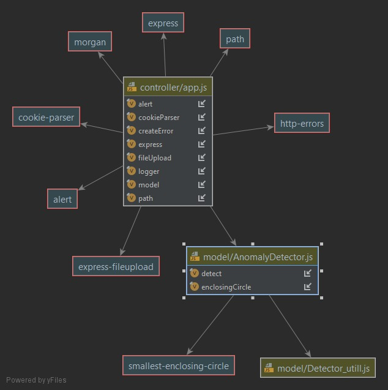

# Anomaly Server Detection


# Anomaly Server node js project
## 

Anomaly Server was written in node.js technolgy using express server template


## Features

- Connect to our Anomaly Detection server on localhost::8080
- Upload your own CSV files data of flight , one for train our model , and the other to detect the anomalies of the flight
- Choose your detect algorithm :
 Linear Regression Detector , or , Minimum Circle Detector and submit your choice
- Click on the Detect button in order to run the detect algorithm you chose
- See the anomlies detected by our server in the frame located in the bottom of the screen
- You can also send Post http request at localhost:8080/detect to get the result as JSON object


## Http POST

In order to send http POST to server , you could use 
Postman : https://www.postman.com/downloads/

To send Http POST request and get the anomalies as JSON send request at  

```bash
localhost:8080/detect
```

and chose your files with the keys : 

learnFile  - as key to CSV train file

detectFile  - as key to CSV detect file

type - as key to type of the detector (currently support only "simple" or "hybrid"


## Running
(instructions written for Windows users)

requirements : Node.js 

you can download it from : https://nodejs.org/en/

After installing node js , you can download files as zip or git clone the project to your own PC

When all of the files located in your PC open the CMD windows (command line prompt) and change the directory to 

```bash
your-downloaded-path/AnomalyServer/bin
```

example :


When all set up , and you are in the current directory use the command :

```bash
npm install
```
after it finished installing all the required npm's use command

```bash
node www
```
now server is running ! , open your browser at 

```bash
localhost:8080
```
chose your files 

upload your files (provided examples for your use at files_csv) via uplaod buttons 
(each file has its own upload button)

chose your algorithm (simple / hybrid ) and Submit

then click on Detect

now you can see the results below


 NOTICE : we assumed CSV files comes with first line name of the features .

for running example you can use follwing files provided insise main branch git under files_csv directory: 

* reg_flight.csv - for learn file
* anomaly_flight.csv - for detect file
or 

* train.csv - for learn file
* test.csv - for detect file

## npm's 

In our development of Anomaly-Detection-Server

we used the following npm

smallest-enclosing-circle - used in minimum circle algorithm

alert - used when error occured ( such as no csv uploaded) 


| npm | Link |
| ------ | ------ |
| smallest-enclosing-circle |https://www.npmjs.com/package/smallest-enclosing-circle |
| alert | https://www.npmjs.com/package/alert


# UML Diagram 




that all for now see you in next version update !

* Current Version 1.0 


